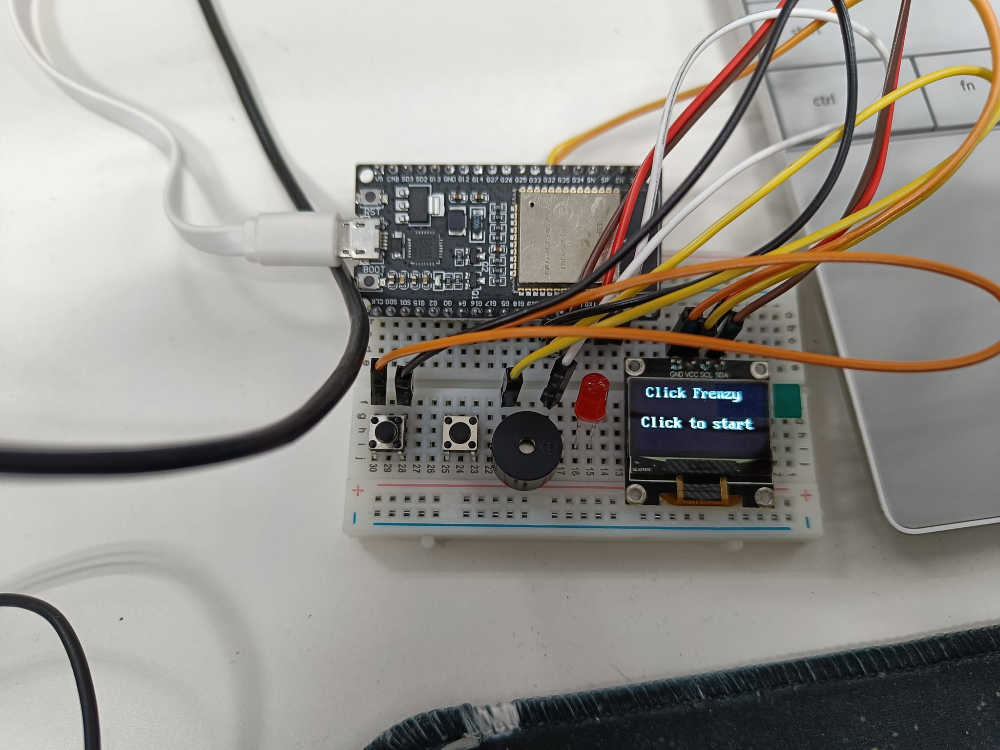

# ESP32 Micropython ClickFrenzy Game!

This repo stores a small MicroPython project I made for a maker contest
The player has 5 seconds to bash a button as fast as possible to gain as much clicks as possible

We are utilizing ESP32 board and an SSD1306 display module.
An optional buzzer and a simple click button

